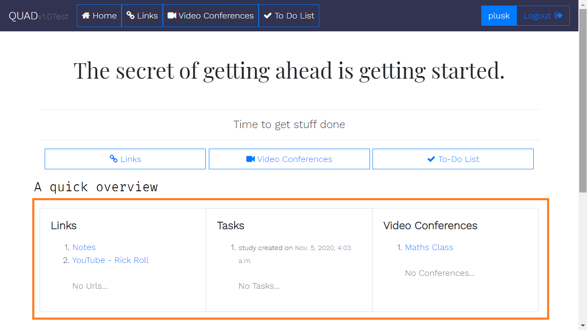
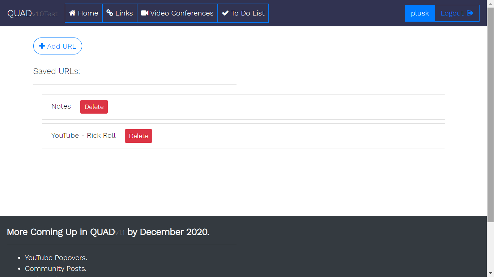
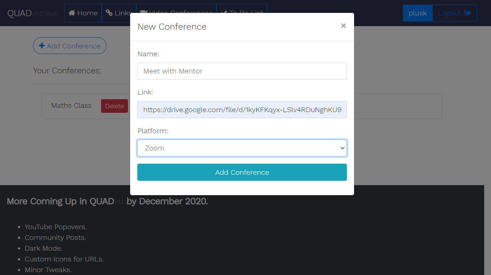
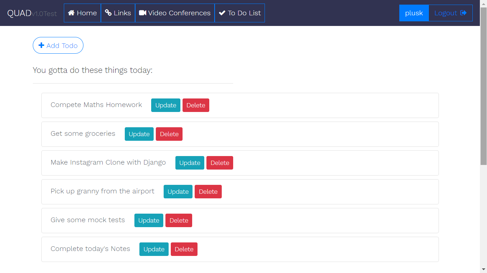

# QUAD-twt_oct
QUAD is a web app aimed at getting all the things like links, joining links to video conferences and a To Do list, all at one place so that students are able into get to a lot of things on the internet without wasting their time searching for the website or asking their friends for class' joining links. Also, a to do app will help them know how productive and organized they are. New features like YouTube Popovers, Dark Mode, Custom Icons and Task Badges coming up in QUAD v1.1 by December 2020.

This is a Django project so for this one all you need is Django installed and working properly.
Be sure to run the  following commands for the app to work properly:
1. `python manage.py makemigrations`
2. `python manage.py migrate`
3. `python manage.py runserver`

Here are some screenshots for peopl who are too lazy to set up:

For suggestions, my discord: <strong>yuvraj#3442</strong>
 

Look carefully ;)  

